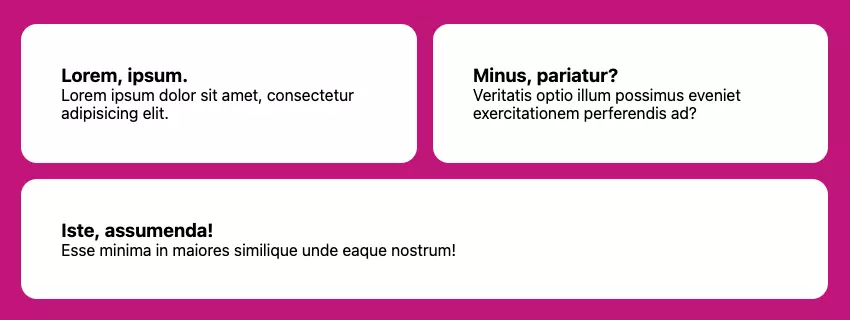

# Nguồn https://www.sitepoint.com/responsive-css-layout-grids-without-media-queries/

## Responsive với bố cục lưới

Đầu tiên, có lẽ là giải pháp yêu thích của tôi vì tính linh hoạt và dễ sử dụng. Sử dụng Grid, chúng ta có thể tạo một bộ cột đáp ứng tạo ra chính nó khi cần thiết. Chúng ta sẽ cung cấp một ràng buộc duy nhất — một chiều rộng tối thiểu mà các cột có thể có — đóng vai trò như một `breakpoint` trước khi các mục cột chuyển sang hàng mới.

Dưới đây là tất cả những gì cần thiết để thực hiện responsive bố cục lưới này, nơi kích thước cột tối thiểu của chúng ta được đặt là 30ch thông qua một thuộc tính tùy chỉnh trợ giúp. Quy tắc này hướng dẫn trình duyệt tạo ra nhiều cột nhất có thể với chiều rộng ít nhất là 30ch:

```css
.grid {
  --min: 30ch;
  display: grid;
  grid-template-columns: repeat(auto-fit, minmax(min(100%, var(--min)), 1fr));
}
```

Vì 1fr là giá trị `max` của `minmax()`, các cột cũng được phép giãn ra để lấp đầy không gian còn lại trong một hàng một cách đồng đều. Vì vậy, nếu không gian có sẵn là 80ch và có hai phần tử con của lưới, mỗi cột sẽ chiếm 40ch. Nếu có ba phần tử con, phần tử thứ ba sẽ nằm ở hàng thứ hai, vì 80 không chia đều cho kích thước tối thiểu cho phép là 30ch.

> CodePen demo này cung cấp một ví dụ trực tiếp về bố cục `Grid`.

```html
<style>
  <style > .grid {
    --min: 30ch;
    display: grid;
    grid-template-columns: repeat(auto-fit, minmax(min(100%, var(--min)), 1fr));
    gap: 1rem;
  }

  body {
    --padding: 5vw;
    --max-width: 180ch;
  }
</style>

<ul role="list" class="grid">
  <li class="card">
    <h3>Lorem, ipsum.</h3>
    <p>Lorem ipsum dolor sit amet, consectetur adipisicing elit.</p>
  </li>
  <li class="card">
    <h3>Minus, pariatur?</h3>
    <p>Veritatis optio illum possimus eveniet exercitationem perferendis ad?</p>
  </li>
  <li class="card">
    <h3>Iste, assumenda!</h3>
    <p>Esse minima in maiores similique unde eaque nostrum!</p>
  </li>
  <li class="card">
    <h3>Voluptatem, veritatis!</h3>
    <p>Provident deserunt veniam, debitis alias atque deleniti laboriosam!</p>
  </li>
  <li class="card">
    <h3>Accusamus, magnam.</h3>
    <p>Ipsum accusantium laboriosam, architecto cum dolor odit animi?</p>
  </li>
  <li class="card">
    <h3>Recusandae, placeat.</h3>
    <p>Incidunt, aliquid odit! Eaque nihil mollitia repellat beatae.</p>
  </li>
</ul>
```

## Responsive với bố cục Flexbox

Chúng ta có thể đạt được trải nghiệm tương tự với `Flexbox`. Sự khác biệt giữa giải pháp `Flexbox` và `Grid` là các `grid items` chuyển sang hàng mới không thể mở rộng qua nhiều cột lưới. Với `Flexbox`, chúng ta có thể chỉ đạo các mục flex để phát triển để lấp đầy tất cả không gian còn lại, ngăn chặn một `orphan` xuất hiện trong giải pháp `Grid`.

Trong đoạn mã này, cũng như trong mã Grid, trình duyệt sẽ tạo ra nhiều cột nhất có thể phù hợp với không gian nội tuyến với ít nhất kích thước `--min` là `30ch`. Nếu chúng ta có ba mục và mục thứ ba cần chuyển sang hàng mới, nó sẽ chiếm không gian còn lại do thuộc tính `flex shorthand`, điều quan trọng là đặt `flex-grow` thành 1. Do đó, nó có hành vi tương tự như 1fr trong hầu hết các trường hợp.

```css
.flexbox-grid {
  --min: 30ch;
  display: flex;
  flex-wrap: wrap;
}

.flexbox-grid > \* {
  flex: 1 1 var(--min);
}
```

Hình ảnh dưới đây cho thấy mục danh sách cuối cùng, có số lẻ, kéo dài qua hai cột, nhờ vào thuộc tính `flex-grow`.


> Lưu ý: trong cả hai giải pháp `Grid` và `Flexbox`, nếu chúng ta thêm một khoảng trống, không gian đó sẽ được trừ đi khi tính toán số cột có thể tạo trước khi thêm hàng mới.

Độc giả sẽ nhận thấy một khác biệt quan trọng khác giữa các giải pháp này: khi sử dụng Grid, phần tử cha xác định hành vi của các phần tử con. Đối với Flexbox, chúng ta thiết lập hành vi bố cục của các phần tử con trên chính chúng. Thuộc tính shorthand của flex thiết lập, theo thứ tự, `flex-grow`, `flex-shrink`, và `flex-basis`.

Như một thử nghiệm, chúng ta có thể thay đổi giá trị `flex-grow` thành 0 và xem các mục chỉ mở rộng đến giá trị `flex-basis`. (Hãy thử với demo CodePen dưới đây.) Điều quan trọng là giữ cho `flex-shrink` là 1, để khi không gian nội tuyến có sẵn hẹp hơn `flex-basis`, các mục vẫn được phép `shrink`, giúp ngăn chặn tràn bộ.

Demo CodePen sau đây cho thấy bố cục `Flexbox` của chúng tôi trong hành động.

```html
<style>
  .flexbox-grid {
    --min: 30ch;
    display: flex;
    flex-wrap: wrap;
    gap: 1rem;
  }

  .flexbox-grid > * {
    flex: 1 1 var(--min);
  }

  body {
    --padding: 5vw;
    --max-width: 180ch;
  }
</style>

<ul role="list" class="flexbox-grid">
  <li class="card">
    <h3>Lorem, ipsum.</h3>
    <p>Lorem ipsum dolor sit amet, consectetur adipisicing elit.</p>
  </li>
  <li class="card">
    <h3>Minus, pariatur?</h3>
    <p>Veritatis optio illum possimus eveniet exercitationem perferendis ad?</p>
  </li>
  <li class="card">
    <h3>Iste, assumenda!</h3>
    <p>Esse minima in maiores similique unde eaque nostrum!</p>
  </li>
</ul>
```

Thuộc tính `flex-basis` có thể được điều chỉnh thêm cho giải pháp này để chỉ định các `breakpoint` độc đáo cho từng mục khác nhau. Vì chúng ta đang thiết lập giá trị đó qua thuộc tính tùy chỉnh `--min`, và các con của `Flexbox` điều khiển kích thước của chính họ, chúng ta có thể điều chỉnh nó với một kiểu nội tuyến:

```
<li style="--min: 40ch">...</li>
```

Các mục con còn lại trong ví dụ này vẫn sẽ dòng chảy xung quanh nó và sử dụng 30ch từ quy tắc cơ bản, nhưng cột rộng hơn thực tế làm thay đổi hành vi.

Dưới đây là một demo CodePen của mã này trong hành động.

```html
<style>
  .flexbox-grid {
    --min: 25ch;
    display: flex;
    flex-wrap: wrap;
    gap: 1rem;
  }

  .flexbox-grid > * {
    flex: 1 1 var(--min);
  }

  body {
    --padding: 3vw;
    --max-width: 180ch;
  }
</style>

<ul role="list" class="flexbox-grid">
  <li class="card">
    <h3>Lorem, ipsum.</h3>
    <p>Lorem ipsum dolor sit amet, consectetur adipisicing elit.</p>
  </li>
  <li class="card" style="--min: 40ch">
    <h3>Custom "Breakpoint" --min</h3>
    <p>Veritatis optio illum possimus eveniet exercitationem perferendis ad?</p>
  </li>
  <li class="card">
    <h3>Iste, assumenda!</h3>
    <p>Esse minima in maiores similique unde eaque nostrum!</p>
  </li>
  <li class="card">
    <h3>Molestiae, quo.</h3>
    <p>Quos ullam, iure inventore delectus sequi aliquam omnis!</p>
  </li>
  <li class="card">
    <h3>Illo, facere!</h3>
    <p>Vel pariatur quod alias, quaerat porro sint quas.</p>
  </li>
</ul>
```

Dưới đây là hai kỹ thuật `Flexbox` khác sử dụng `flex-grow` và `flex-basis` theo những cách thú vị:

- [Flexbox Holy Albatross](https://heydonworks.com/article/the-flexbox-holy-albatross-reincarnated/), chuyển đổi từ các cột thành một hàng duy nhất dựa trên tổng chiều rộng của `container` cha.
- [sidebar layout](https://every-layout.dev/layouts/sidebar/), cho thấy cách ép các điểm ngắt Flexbox khác nhau để kiểm soát tốt hơn thời điểm các mục gói lại.

## Câu hỏi thường gặp (FAQs) về Responsive CSS Layout Grids

### Sự khác biệt giữa CSS Grid và Flexbox là gì?

`CSS Grid` và `Flexbox` đều là các hệ thống bố cục mạnh mẽ trong CSS. Mặc dù chúng có thể được sử dụng cùng nhau, nhưng mỗi hệ thống đều có những ưu điểm riêng. `CSS Grid` là một hệ thống hai chiều, nghĩa là nó có thể xử lý cả cột và hàng, `making it ideal for web page layout` (tạo ý tưởng cho bố cục trang web). Mặt khác, Flex`box là một mô hình bố cục một chiều và được sử dụng để thiết kế bố cục quy mô nhỏ, trong khi` CSS grid` được dành cho bố cục quy mô lớn.

### Làm thế nào để tạo bố cục đáp ứng mà không cần sử dụng media query?

Bạn có thể tạo bố cục đáp ứng mà không cần sử dụng media query bằng cách sử dụng `CSS Grid` hoặc `Flexbox`. Các hệ thống bố cục này cho phép bạn tạo các bố cục linh hoạt thích ứng với các kích thước màn hình khác nhau. Ví dụ, với `CSS Grid`, bạn có thể sử dụng đơn vị `fr` để tạo các đường ray lưới linh hoạt thay đổi kích thước dựa trên không gian.

### Đơn vị ‘fr’ hoạt động như thế nào trong CSS Grid?

Đơn vị `fr` trong `CSS Grid` đại diện cho (phân số). Nó biểu thị một phần của không gian có sẵn trong bộ chứa lưới. Ví dụ, nếu bạn có một lưới với hai cột và bạn đặt chiều rộng của một cột là 1fr và cột kia là 2fr, cột đầu tiên sẽ chiếm một phần ba không gian có sẵn và cột thứ hai sẽ chiếm hai phần ba.

### Tôi có thể sử dụng CSS Grid và Flexbox cùng nhau không?

Có, `CSS Grid` và `Flexbox` có thể được sử dụng cùng nhau. Bạn có thể sử dụng CSS Grid để bố cục cấu trúc tổng thể của trang, sau đó sử dụng `Flexbox` bên trong các mục lưới để bố cục nội dung của chúng. Điều này cho phép bạn tận dụng các điểm mạnh của cả hai hệ thống bố cục.

### Làm thế nào để căn chỉnh các mục trong một container Flexbox?

Bạn có thể căn chỉnh các mục trong `container` Flexbox bằng cách sử dụng thuộc tính ‘align-items’. Thuộc tính này chấp nhận một số giá trị, bao gồm `flex-start`, `flex-end`, `center`, `baseline` và `stretch`. Ví dụ: `align-items: center` sẽ căn chỉnh các mục theo chiều dọc ở giữa `container`.

### Sự khác biệt giữa ‘justify-content’ và ‘align-items’ trong Flexbox là gì?

Trong `Flexbox`, `justify-content` được sử dụng để căn chỉnh các mục dọc theo trục chính (theo chiều ngang nếu `flex-direction` là `row`, theo chiều dọc nếu `flex-direction` là `column`), trong khi ‘align-items’ được sử dụng để căn chỉnh các mục dọc theo trục phụ (vuông góc với trục chính).

### Làm thế nào để tạo một lưới với các cột có chiều rộng bằng nhau trong CSS Grid?

Bạn có thể tạo một lưới với các cột có chiều rộng bằng nhau trong CSS Grid bằng cách đặt thuộc tính `grid-template-columns` thành một loạt các giá trị ‘1fr’. Ví dụ: `grid-template-columns: 1fr 1fr 1fr` sẽ tạo một lưới với ba cột có chiều rộng bằng nhau.

### Làm thế nào để làm cho container Flexbox cuộn được?

Bạn có thể tạo `container Flexbox` cuộn được bằng cách đặt thuộc tính `overflow` thành `auto` hoặc `scroll`. Điều này sẽ thêm thanh cuộn vào container nếu nội dung tràn ra ngoài ranh giới của container.

### Tôi có thể sử dụng CSS Grid và Flexbox trong tất cả các trình duyệt không?

`CSS Grid` và `Flexbox` được hỗ trợ trong tất cả các trình duyệt hiện đại, bao gồm Chrome, Firefox, Safari và Edge. Tuy nhiên, chúng không được hỗ trợ trong Internet Explorer 10 trở về trước. Bạn có thể sử dụng các công cụ như Autoprefixer để thêm các tiền tố nhà cung cấp cần thiết để tương thích tốt hơn với trình duyệt.

### Làm thế nào để tìm hiểu thêm về CSS Grid và Flexbox?

Có rất nhiều tài nguyên trực tuyến để tìm hiểu về `CSS Grid` và `Flexbox`. `Mozilla Developer Network` (MDN) có hướng dẫn toàn diện về cả CSS Grid và `Flexbox`. Bạn cũng có thể tìm thấy hướng dẫn trên các trang web như `CSS-Tricks` và các khóa học trên các nền tảng như `Codecademy` và `Udemy`.
